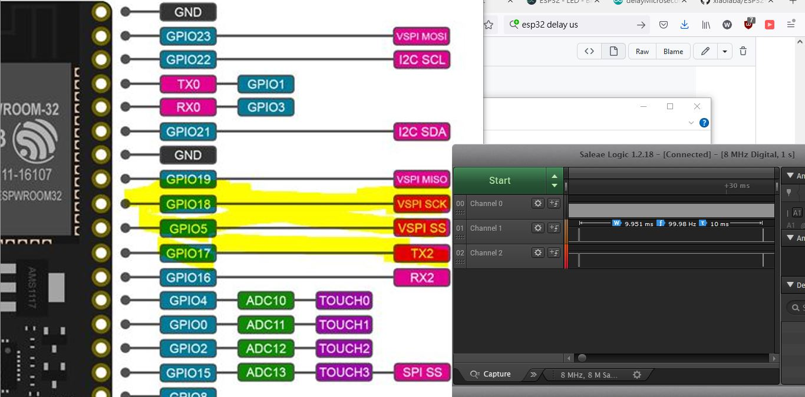
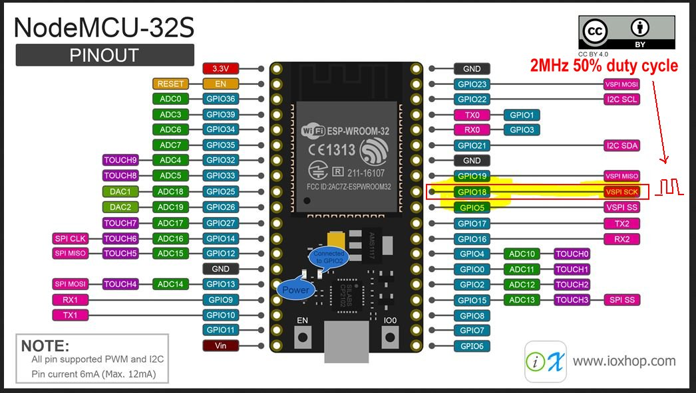
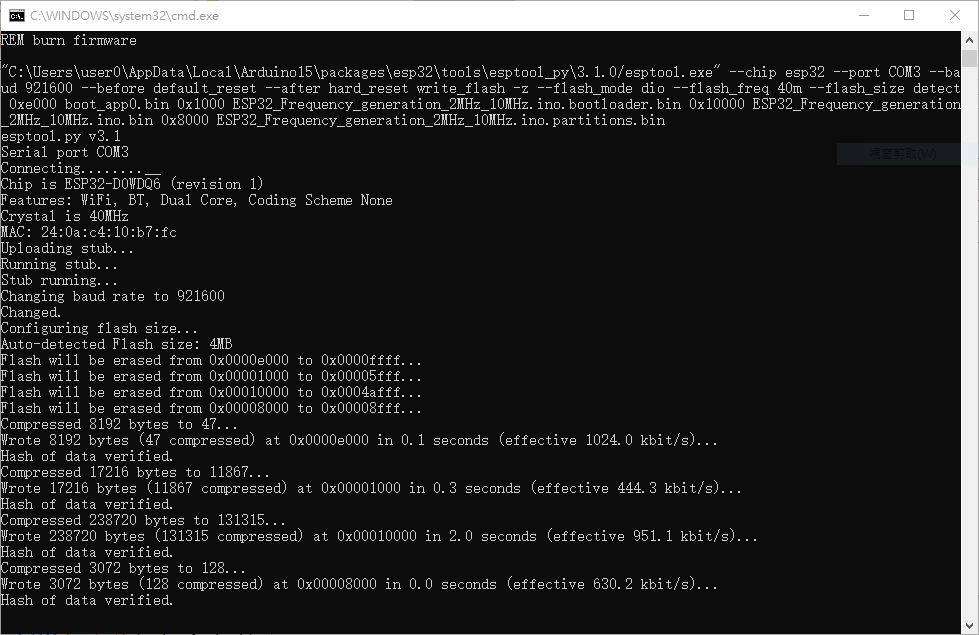
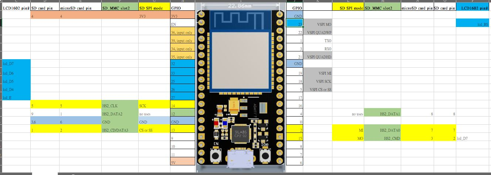

# ESP32_Frequency_generation_2MHz_10MHz  
esp32, 想現撿現成的, 請問有沒有開源的ARDUINO 項目, 可以在一個 IO 輸出方波, 頻率範圍 2MHz - 10MHz, 每顆esp32輸出固定的頻率就好. 產生測試訊號用途, 因為要好幾台sig-gen一起出力, 不夠小朋友, 想找便宜的替代方法.  


### [firmware_1MHz](firmware_1MHz), 1MHz osc, 修改過的源碼包含在內 
鄰近的 GPIO5, GPIO17, 輸出50us pulse, 10ms 間隔  
GPIO2, 板子上的藍色 LED, 微亮, 根據以上pulse 頻率  
原因如以下源碼所列,
```
void line_scan()
{

  digitalWrite(LINE_PULSE_GPIO, HIGH);
  digitalWrite(LINE_PULSE_INVERT_GPIO, LOW);
  digitalWrite(LED_GPIO, HIGH);

  delayMicroseconds(50);  //50us pulse
//  delay(500);  // 10 ms
  
  digitalWrite(LINE_PULSE_GPIO, LOW);
  digitalWrite(LINE_PULSE_INVERT_GPIO, HIGH);
  digitalWrite(LED_GPIO, LOW);

  delay(10);  // 10 ms
}

```

掛上 logic analysier, 確認訊號產生如預期  

  


### FFT_on_ESP32_PCM1808_03.zip 不行的 換一個, 好了  
整數1/2/4MHz 才可, 其他頻率有jitter, 10MHz 不行, 沒時間研究它
GPIO18 輸出, 腳位看圖

  


### [firmware](firmware), 2MHz, testing, only  
burn.bat 燒錄指令檔,  
COM3 要改, 每台PC或許會不同  
C:\Users\user0\AppData\Local\Arduino15\packages\esp32\tools\esptool_py\3.1.0/esptool.exe, 可能也要改, 每個ARDUINO IDE 版本不同  

WIN10底下, 燒錄的結果,  
  

示波器或者邏輯分析儀掛到GPIO18, 應該可以看到 2MHz 50% 的方波   


.
.


### hardware  
pin 18 used for frequency output  
硬件 ESP-WROOM-32 只有 4M FLASH, 並沒有 PSRAM……它是 NodeMCU ESP-32S 或者是山寨的??  
  


### 懶惰, 找到這個, 果然不行, 放棄它.
https://www.edaboard.com/threads/issues-with-generating-11-mhz-square-wave-on-esp32-esp32-wrover-board.401727/post-1730410   
  
本地存檔 [FFT_on_ESP32_PCM1808_03.zip](FFT_on_ESP32_PCM1808_03.zip)  

試試看行不行, 再來改.  

果然不行, 充滿 BUG 的源碼, 原因??
```
rst:0x1 (POWERON_RESET),boot:0x13 (SPI_FAST_FLASH_BOOT)
flash read err, 1000
Falling back to built-in command interpreter.
OK
>ets Jun  8 2016 00:22:57

rst:0x10 (RTCWDT_RTC_RESET),boot:0x13 (SPI_FAST_FLASH_BOOT)
configsip: 0, SPIWP:0xee
clk_drv:0x00,q_drv:0x00,d_drv:0x00,cs0_drv:0x00,hd_drv:0x00,wp_drv:0x00
mode:DIO, clock div:2
load:0x3fff0030,len:1284
load:0x40078000,len:12808
load:0x40080400,len:3032
entry 0x400805e4

Starting ...ESP32_Frequency_generation_2MHz_10MHz_pin18

E (45) ledc: requested frequency and duty resolution can not be achieved, try reducing freq_hz or duty_resolution. div_param=5

Program Started

```


